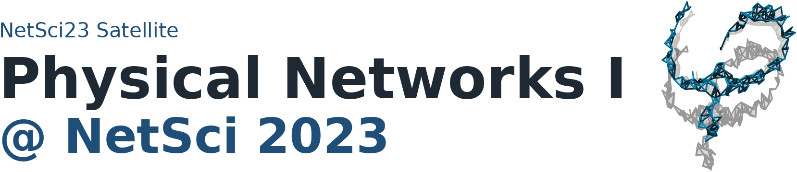
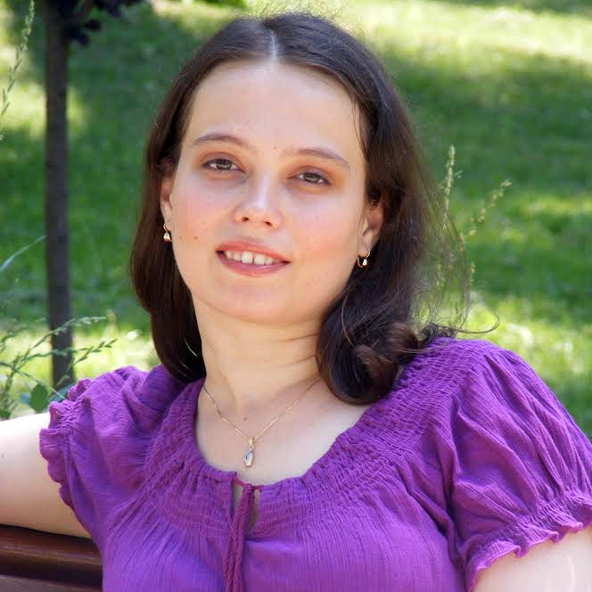

:::{ .landing-title }

```{=html}
<div class="landing-title-image-wrap edition-title-image-wrap">
  
</div>
```

<div class="subtitle">Physical networks are complex systems subjected to physical constraints, such as volume exclusion or repulsive forces, that shape their networked organization. Systems such as neurons, fiber networks, cell cytoskeletons, and mycorrhizal architectures are composed of links and nodes that are physical objects and therefore cannot overlap with each other.</div>

<a class="btn-physnet" href="#program">View program</a>
<a class="btn-physnet secondary" href="https://sites.google.com/view/physnet23/">Original Google Site</a>
:::

::: {.event-summary}
::: {.summary-item}
**Date**  
July 11, 2023
:::

::: {.summary-item}
**Time**  
14:00 to 18:00
:::

::: {.summary-item}
**Venue**  
University of Vienna, Universitätsring 1, 1010 Wien, Austria
:::

::: {.summary-item}
**Room**  
Seminarraum 6
:::
:::

## Speakers

::: {.speaker-grid}
::: {.speaker-card .with-photo}


### Albert-László Barabási
Northeastern University, Harvard Medical School
:::

::: {.speaker-card .with-photo}


### Maria Ercsey-Ravasz
Faculty of Physics, Babeș-Bolyai University; Transylvanian Institute of Neuroscience
:::

::: {.speaker-card .with-photo}


### Sang Hoon Lee
Department of Physics, Gyeongsang National University
:::

::: {.speaker-card .with-photo}


### Ádám Timár
Faculty of Physical Science, University of Iceland; Alfréd Rényi Institute of Mathematics
:::

::: {.speaker-card .with-photo}


### Andreas Neophytou
School of Chemistry, University of Birmingham
:::

:::

## Program {#program}

::: {.program-list}

::: {.program-item}
<div class="program-time">14:00 to 14:05</div>
<div class="program-title">Welcome</div>
<div class="program-speaker">Workshop organizers</div>
:::

::: {.program-item}
<div class="program-time">14:05 to 14:40</div>
<div class="program-title">Understanding the role of physicality in networks</div>
<div class="program-speaker">Albert-László Barabási</div>

<details>
<summary>Abstract</summary>

I will explore the applications of the network science toolset to physical networks, like the brain or metamaterials, which are networks whose links are physical entities that cannot cross each other. Link physicality affects both the evolution and the structure of a network, in a way that is not captured by current graph-based approaches. Yet, the existence of an exact mapping between physical networks and independent sets allows us to derive the onset of physical effects and the emergence of a jamming transition, demonstrating that physicality impacts the network structure even when the total volume of the links is negligible.

</details>
:::

::: {.program-item}
<div class="program-time">14:40 to 15:05</div>
<div class="program-title">Modeling the inter-areal cortical network based on a distance rule: from the macaque to the mouse</div>
<div class="program-speaker">Maria Ercsey-Ravasz</div>

<details>
<summary>Abstract</summary>

Mammals show a wide range of brain sizes, reflecting adaptation to diverse habitats. Comparing inter-areal cortical networks across brains of different sizes and mammalian orders provides robust information on evolutionarily preserved features and species-specific processing modalities. However, these networks are spatially embedded, directed, and weighted, making comparisons challenging. Analysis of the large-scale connectome inferred from a consistent database of retrograde tracer experiments in the macaque cortex has shown that many of its local, global, and weighted properties are well predicted by a simple network model based on an exponential distance rule. Here we show that the large-scale connectome of the mouse and rat cortex is also strongly determined by an exponential distance rule but with a different decay rate. Comparisons reveal network invariants between species, exemplified in motif profiles and connection similarity indices, but also significant differences, including fractionally smaller and much weaker long-distance connections in the macaque than in the mouse.

</details>
:::

::: {.program-item}
<div class="program-time">15:05 to 15:30</div>
<div class="program-title">A network-of-networks model for physical networks</div>
<div class="program-speaker">Ádám Timár</div>

<details>
<summary>Abstract</summary>

Physical networks are networks represented in Euclidean space with edges thought of as physical objects with constraints, for example that they cannot intersect. We define a model through a dynamical process: a sequence of loop-erased random walks on the grid, run until they hit the previously constructed piece of the network. The trajectory of one such walk will then be a vertex of the corresponding abstract network, with adjacencies given by how the trajectories hit. Relying on this representation, we model the growth of physical networks and show that volume exclusion induces heterogeneity in both node volume and degree, with the two becoming correlated. Calculating the Laplacian spectra of these networks, we show that these correlations strongly affect their function.

</details>
:::

::: {.program-item .break}
<div class="program-time">15:30 to 16:00</div>
<div class="program-title">Coffee break</div>
:::

::: {.program-item}
<div class="program-time">16:00 to 16:25</div>
<div class="program-title">Scale-dependent landscape of semi-nested community structures of 3D chromosome contact networks</div>
<div class="program-speaker">Sang Hoon Lee</div>

<details>
<summary>Abstract</summary>

Mammalian DNA folds into 3D structures that facilitate and regulate transcription, DNA repair, and epigenetics. Several insights derive from chromosome capture methods such as Hi-C, which allow researchers to construct contact maps of 3D interactions among DNA segment pairs. We extract 3D communities using the generalized Louvain algorithm with an adjustable resolution parameter, construct hierarchical trees connecting these communities, and find that chromosomes are more complex than a perfect hierarchy. We also investigate inconsistency in 3D communities in Hi-C data and relate nodal inconsistency or functional flexibility to local chromatin activity.

</details>
:::

::: {.program-item}
<div class="program-time">16:25 to 16:50</div>
<div class="program-title">Untangling the Mysteries of Supercooled Water</div>
<div class="program-speaker">Andreas Neophytou</div>

<details>
<summary>Abstract</summary>

The origin of the anomalous thermodynamic properties of liquid water has been debated for decades. One hypothesis is that a first-order liquid-liquid phase transition line for water exists in the supercooled region of its pressure-temperature phase diagram, terminating at a liquid-liquid critical point. We design a colloidal analogue of liquid water that is experimentally approachable and displays a liquid-liquid critical point. Using topology, we introduce an order parameter for the transition and show that the transition is between two topologically distinct liquid networks.

</details>
:::

::: {.program-item}
<div class="program-time">16:50 to 17:05</div>
<div class="program-title">Effects of Network Topology on Physical Entanglement</div>
<div class="program-speaker">Cory Glover</div>

<details>
<summary>Abstract</summary>

Physical networks are networks embedded in three-dimensional space where nodes and links have both position and thickness. We define the crossing matrix of a physical network and use it to measure entangledness in physical networks with the average crossing number. In general, there is a positive correlation between energy in the system and the average crossing number. We focus on linear physical networks and find that system size, average degree, and degree heterogeneity affect the growth in network entanglement as system energy increases.

</details>
:::

::: {.program-item}
<div class="program-time">17:05 to 17:20</div>
<div class="program-title">On the evolution of physical networks</div>
<div class="program-speaker">Hillel Sanhedrai</div>

<details>
<summary>Abstract</summary>

Unlike virtual connections, in physical networks such as the brain or vascular system, links are physical objects. They occupy volume and cannot intersect each other. This characteristic affects the connectivity pattern of evolving networks. We aim to find a theory to describe the evolution of such networks, with a specific focus on the degree and link-length distributions.

</details>
:::

::: {.program-item}
<div class="program-time">17:20 to 17:35</div>
<div class="program-title">Robustness of physical networks against spatial damage</div>
<div class="program-speaker">Luka Blagojević</div>
:::

::: {.program-item}
<div class="program-time">17:35</div>
<div class="program-title">Closing remarks</div>
<div class="program-speaker">Workshop organizers</div>
:::

:::

## Organizers

::: {.organizer-grid}

::: {.speaker-card}
### Márton Pósfai
Department of Network and Data Science, CEU
:::

::: {.speaker-card}
### Ivan Bonamassa
Department of Network and Data Science, CEU
:::

:::

## Keywords

::: {.keyword-list}
<span>Graph embeddings and layout</span>
<span>Soft matter</span>
<span>Nonlinear dynamics</span>
<span>Mechanics</span>
<span>Network materials</span>
<span>Biomaterials</span>
<span>Critical phenomena</span>
<span>Graphons and graph limits</span>
:::

## Call for contributions

The workshop welcomed contributions spanning multiple disciplines, including mathematics, physics, material science, computer science, and biophysics. Applications were requested as one-page abstracts sent to physnet@ceu.edu by 31 May 2023.

## Archival note

::: {.archive-note}
Original public page: <https://sites.google.com/view/physnet23/>  
Detailed program page: <https://sites.google.com/view/physnet23/phynet23-program/detailed-program>  
This is a curated static reconstruction intended for long-term preservation on GitHub Pages.
:::
