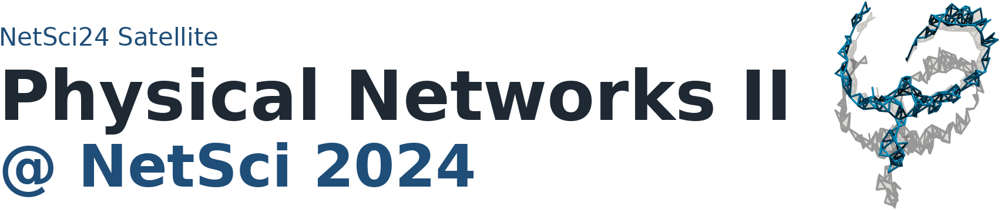
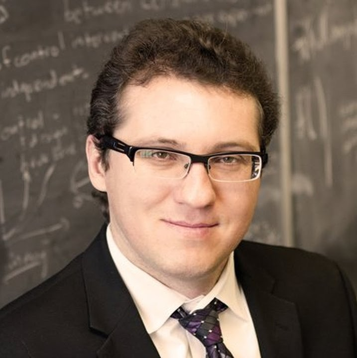
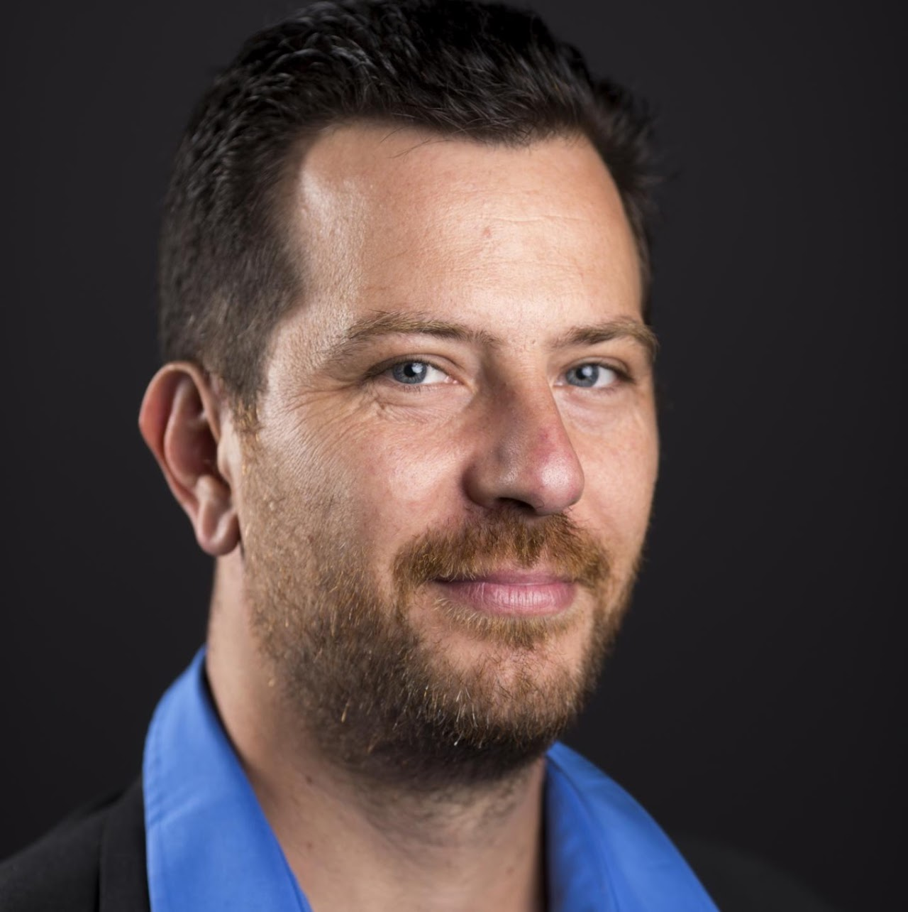
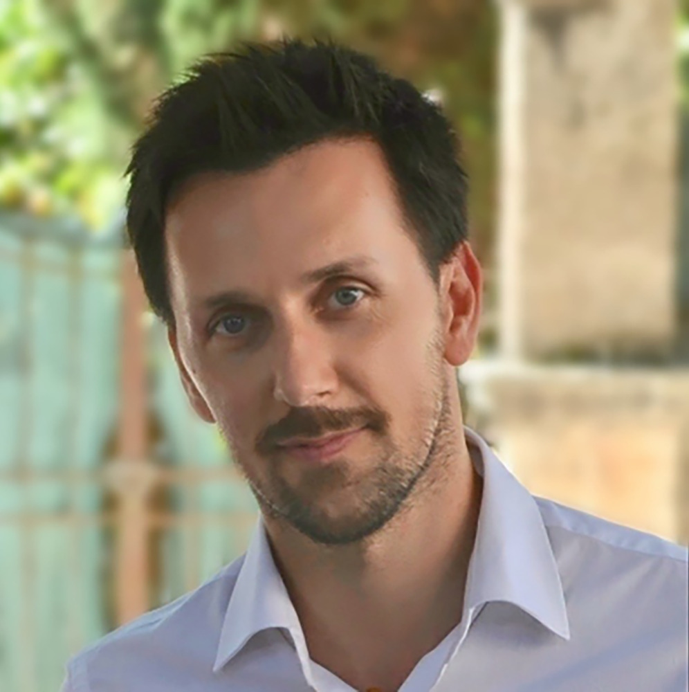
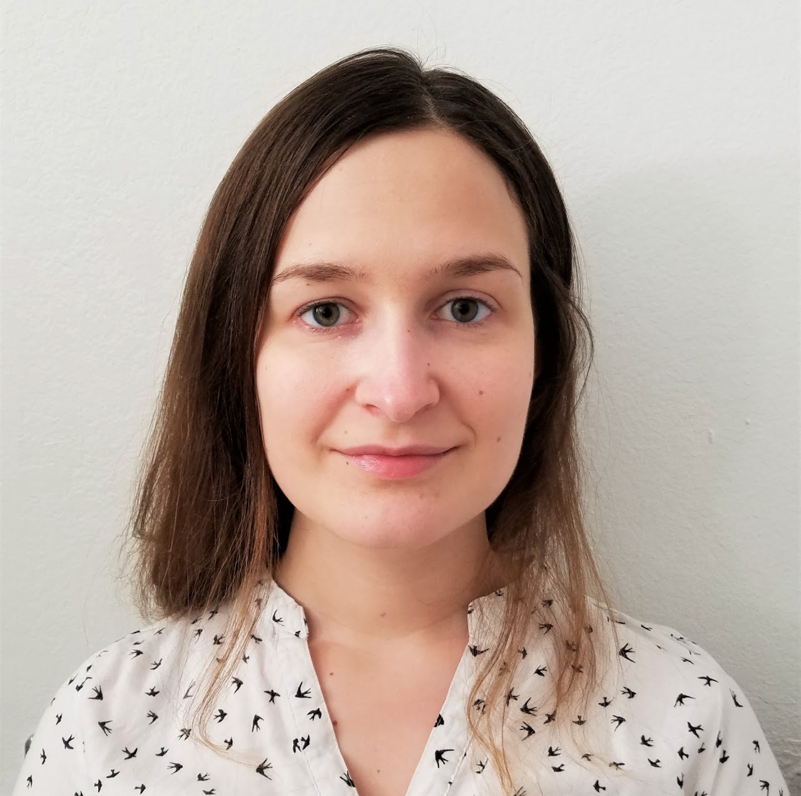
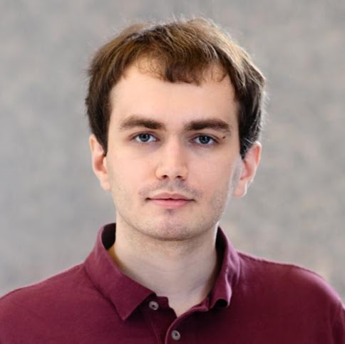
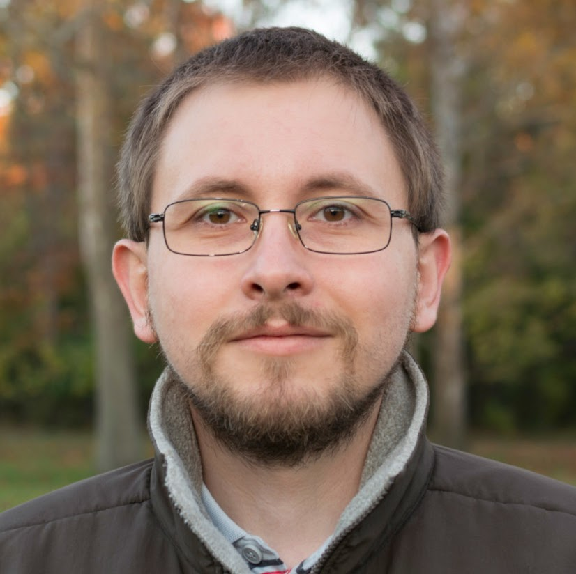

:::{ .landing-title }

```{=html}
<div class="landing-title-image-wrap edition-title-image-wrap">
  
</div>
```

<div class="subtitle">Physical networks aim to understand complex systems subjected to physical constraints, such as volume exclusion or repulsive forces, that shape their topological and geometric organization. Systems as different as neurons, porous and colloidal networks, and disordered metamaterials are made of links and nodes that are physical objects and cannot overlap with each other.</div>

<a class="btn-physnet" href="#program">View program</a>
<a class="btn-physnet secondary" href="https://sites.google.com/view/physnet24/">Original Google Site</a>
:::

<!-- ::: {.meta-strip}

::: {.meta-item}
<span class="meta-label">Date</span>
<span class="meta-value">Monday, June 17, 2024</span>
:::

::: {.meta-item}
<span class="meta-label">Time</span>
<span class="meta-value">09:00 to 13:00</span>
:::

::: {.meta-item}
<span class="meta-label">Venue</span>
<span class="meta-value">Québec City Convention Center, Quebec City, Canada</span>
:::

::: -->

::: {.event-summary}
::: {.summary-item}
**Date**  
June 17, 2024
:::

::: {.summary-item}
**Time**  
09:00 to 13:00
:::

::: {.summary-item}
**Venue**  
Québec City Convention Center, Quebec City, Canada
:::

::: {.summary-item}
**Room**  
TBA
:::
:::

## Speakers

::: {.speaker-grid}
::: {.speaker-card .with-photo}


### Adilson E. Motter
Department of Physics and Astronomy, Northwestern University
:::

::: {.speaker-card .with-photo}


### Filippo Radicchi
Center for Complex Networks and Systems Research, Luddy School of Informatics, Computing, and Engineering, Indiana University
:::

::: {.speaker-card .with-photo}


### Fabrizio De Vico Fallani
National Institute for Research in Digital Science and Technology (INRIA); Paris Brain Institute (ICM)
:::

::: {.speaker-card .with-photo}


### Dániel Barabási
Department of Molecular and Cellular Biology, Harvard University
:::

::: {.speaker-card .with-photo}


### Jasper Van der Kolk
Departament de Física de la Matèria Condensada, Universitat de Barcelona
:::

::: {.speaker-card .with-photo}


### Anastasia Salova
Engineering Sciences and Applied Mathematics, Northwestern University
:::

::: {.speaker-card .with-photo}


### Benjamin Piazza
Department of Physics and Network Science Institute, Northeastern University
:::

::: {.speaker-card .with-photo}


### Szabolcs Horvát
Computer Science Department, Reykjavik University
:::

:::

## Program {#program}

::: {.program-list}

::: {.program-item}
<div class="program-time">09:00 to 09:15</div>
<div class="program-title">Physical Networks: An Overture</div>
<div class="program-speaker">PhysNet II Organizers</div>

<details>
<summary>Abstract</summary>

Following the lines of the first edition, the goal of this Satellite is to ignite discussions and share ideas about physical networks. The organizers opened the event with a short introductory talk outlining a thread connecting the talks in the program and their relation to physical networks.

</details>
:::

::: {.program-item}
<div class="program-time">09:15 to 09:40</div>
<div class="program-title">Physical Networks of Complex Nodes and Edges</div>
<div class="program-speaker">Adilson E. Motter</div>

<details>
<summary>Abstract</summary>

The graph representation of network systems as diagrams of unstructured nodes and edges has proven extremely useful, but often falls short of capturing the essential characteristics of complex physical systems. In such systems, nodes and edges themselves can embody complexity. This talk discussed networks comprising complex nodes and edges, using microfluidic and metamaterial networks as model systems.

</details>
:::

::: {.program-item}
<div class="program-time">09:40 to 10:05</div>
<div class="program-title">Shortest-path percolation on random networks</div>
<div class="program-speaker">Filippo Radicchi</div>

<details>
<summary>Abstract</summary>

This talk introduced a bond-percolation model describing the consumption and eventual exhaustion of resources in transport networks. Edges forming minimum-length paths connecting demanded origin-destination nodes are removed if below a certain budget. As pairs of nodes are demanded and edges removed, the graph undergoes a percolation transition. For finite budget the transition is identical to ordinary percolation, whereas for infinite budget the transition becomes more abrupt.

</details>
:::

::: {.program-item}
<div class="program-time">10:05 to 10:30</div>
<div class="program-title">How many connections can you read?</div>
<div class="program-speaker">Fabrizio De Vico Fallani</div>

<details>
<summary>Abstract</summary>

Network visualization highlights patterns in systems of nodes and edges, but spatial node positions often convey important information about geometrical and physical properties. This work addresses edge crossings from a graph-filtering perspective, asking whether an optimal balance exists between the informative benefit of keeping numerous connections and the cost incurred by their length. Simulations and human response data support an unbiased criterion to filter networks and obtain sparse representations of dense real systems.

</details>
:::

::: {.program-item .break}
<div class="program-time">10:30 to 11:00</div>
<div class="program-title">Coffee break</div>
:::

::: {.program-item}
<div class="program-time">11:00 to 11:20</div>
<div class="program-title">Complex Computations From Developmental Priors</div>
<div class="program-speaker">Dániel Barabási</div>

<details>
<summary>Abstract</summary>

Machine learning models have often overlooked innateness and developmental priors. This talk derived a neurodevelopmental encoding of artificial neural networks, treating the weight matrix as emergent from rules of neuronal compatibility. Updating wiring rules rather than weights can compress parameter count, regularize learning, and select circuits with stable and adaptive performance. Adding spatial network models produces additional parameter compression.

</details>
:::

::: {.program-item}
<div class="program-time">11:20 to 11:40</div>
<div class="program-title">Statistical properties of geometric random graphs and the clustering phase transition</div>
<div class="program-speaker">Jasper van der Kolk</div>

<details>
<summary>Abstract</summary>

Geometric random graph models reproduce structural properties of real networks, including small-worldness, high clustering, and scale-free degree distributions. In these models, nodes live in an underlying metric space that conditions connectivity. This talk studied the statistical properties of the clustering phase transition, the entropy behavior across the critical point, and finite-size scaling in weakly geometric regimes relevant to real networks.

</details>
:::

::: {.program-item}
<div class="program-time">11:40 to 11:55</div>
<div class="program-title">Conserved Neuronal Morphology and Connectivity Scalings Across Species</div>
<div class="program-speaker">Benjamin Piazza</div>

<details>
<summary>Abstract</summary>

Recent advances in electron microscopy and segmentation algorithms enable synaptic-connectivity and ultrastructure reconstructions across species. Applying physical network analyses to seven connectome datasets, this work finds conserved features of neuronal morphology and connectivity, including soma-to-soma distance distributions and synapse formation predicted by physical proximity and parallel dendritic arbor lengths.

</details>
:::

::: {.program-item}
<div class="program-time">11:55 to 12:10</div>
<div class="program-title">Combining topological and physical constraints captures the structure of neural connectomes</div>
<div class="program-speaker">Anastasiya Salova</div>

<details>
<summary>Abstract</summary>

Volumetric brain reconstructions provide an opportunity to study neural connectomes. To put connectomes in context, this work constructs contactomes, networks of neurons in physical contact, and establishes that physical constraints play a crucial role in shaping network structure and can serve as an ingredient in generative models of connectomes.

</details>
:::

::: {.program-item}
<div class="program-time">12:10 to 12:25</div>
<div class="program-title">Characterizing spatial networks through proximity graphs</div>
<div class="program-speaker">Szabolcs Horvát</div>

<details>
<summary>Abstract</summary>

Many classic network-analysis techniques are designed for arbitrary graphs, but many real-world networks exist in physical space and connect nearby nodes. This talk proposed characterizing such networks through beta-skeletons, a family of parametrized proximity graphs that capture spatial-neighbour relations. The method was studied analytically and numerically and applied to three-dimensional biological datasets.

</details>
:::

::: {.program-item}
<div class="program-time">12:25 to 12:30</div>
<div class="program-title">Closing remarks</div>
<div class="program-speaker">PhysNet II Organizers</div>
:::

:::

## Organizers

::: {.organizer-grid}

::: {.speaker-card}
### Márton Pósfai
Department of Network and Data Science, CEU
:::

::: {.speaker-card}
### Ivan Bonamassa
Department of Network and Data Science, CEU
:::

:::

## Keywords

::: {.keyword-list}
<span>Network geometry</span>
<span>Network and soft materials</span>
<span>Statistical topology</span>
<span>Rheology and jamming</span>
<span>Critical phenomena</span>
<span>Random packings</span>
<span>Polymer physics</span>
:::

## Call for contributions

The satellite encouraged applications on topics related to physical networks, including 3D and 2D spatial networks, morphology and function, contact networks, brain networks, and packings. Applications were requested as one-page abstracts sent to physnet@ceu.edu by the extended deadline of 7 May 2024.

## Archival note

::: {.archive-note}
Original public page: <https://sites.google.com/view/physnet24/>  
Detailed program page: <https://sites.google.com/view/physnet24/phynet24/detailed-program>  
This is a curated static reconstruction intended for long-term preservation on GitHub Pages.
:::
