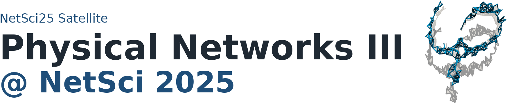
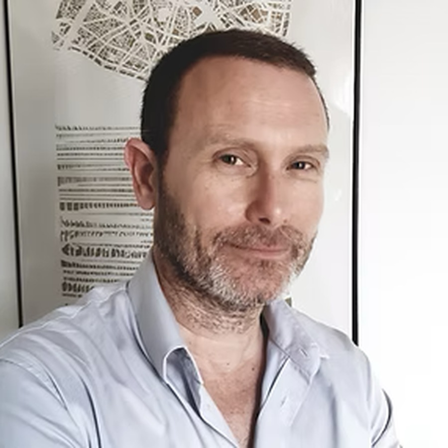
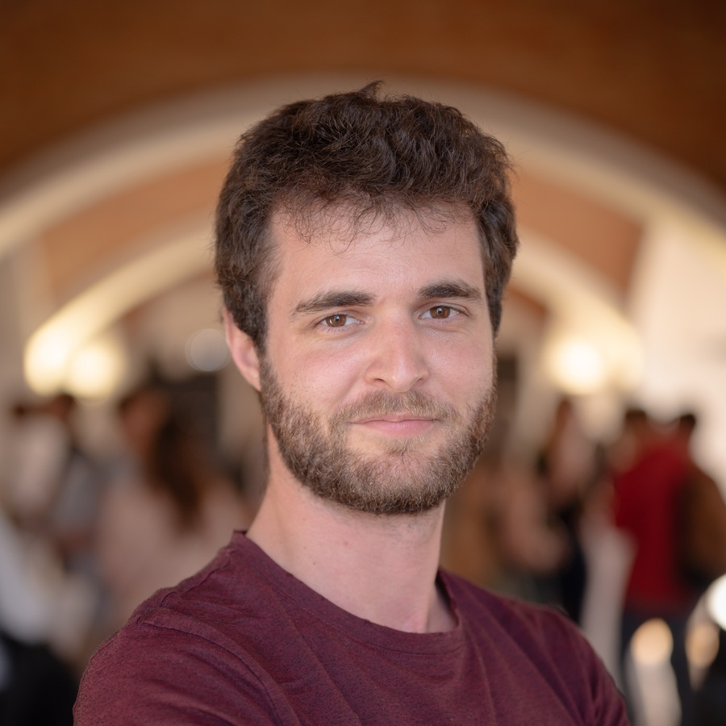
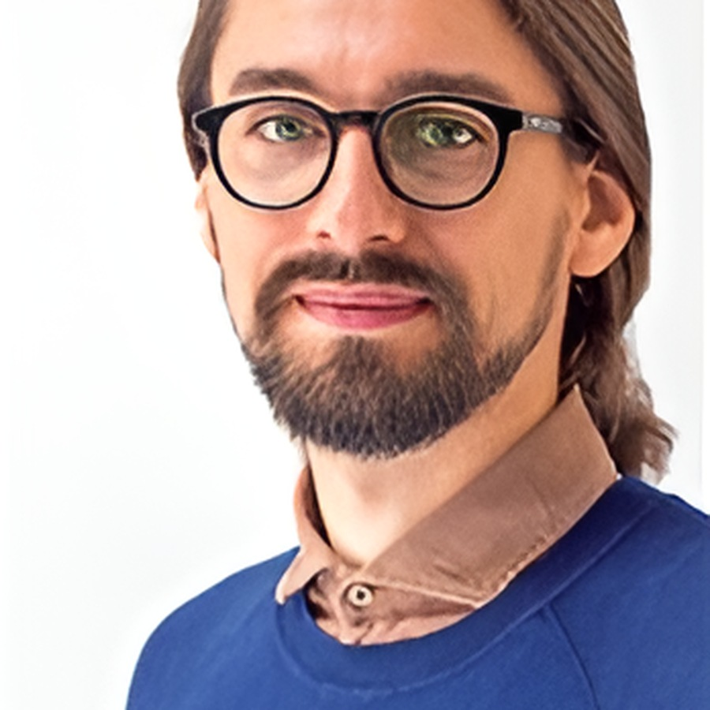

:::{ .landing-title }

```{=html}
<div class="landing-title-image-wrap edition-title-image-wrap">
  
</div>
```

<div class="subtitle">Physical networks aim to understand complex systems subjected to physical constraints, such as volume exclusion or repulsive forces, that shape their topological and geometric organization. Systems such as neurons, cell cytoskeletons, vascular structures, porous and colloidal networks, and disordered metamaterials are made of nodes and links that are physical objects and cannot overlap with each other.</div>

<a class="btn-physnet" href="#program">View program</a>
<a class="btn-physnet secondary" href="https://sites.google.com/view/physnet25/">Original Google Site</a>
:::

<!-- 
::: {.meta-strip}

::: {.meta-item}
<span class="meta-label">Date</span>
<span class="meta-value">June 2, 2025</span>
:::

::: {.meta-item}
<span class="meta-label">Time</span>
<span class="meta-value">14:30 to 18:30</span>
:::

::: {.meta-item}
<span class="meta-label">Venue</span>
<span class="meta-value">MECC Maastricht, Maastricht, the Netherlands</span>
:::

::: {.meta-item}
<span class="meta-label">Room</span>
<span class="meta-value">FSE C1.005 at PHS1, Faculty of Science and Engineering, Maastricht University, Paul-Henri Spaaklaan 1, 6229 EN Maastricht, The Netherlands</span>
:::

::: 
-->

::: {.event-summary}
::: {.summary-item}
**Date**  
June 2, 2026
:::

::: {.summary-item}
**Time**  
14:30 to 18:30
:::

::: {.summary-item}
**Venue**  
MECC Maastricht, Maastricht, the Netherlands
:::

::: {.summary-item}
**Room**  
FSE C1.005 at PHS1, Faculty of Science and Engineering, Maastricht University, Paul-Henri Spaaklaan 1, 6229 EN Maastricht, the Netherlands
:::
:::

## Speakers

::: {.speaker-grid}
::: {.speaker-card .with-photo}


### Marc Barthelemy
Institut de Physique Théorique (CEA) and Centre d'Analyse et de Mathématique Sociales
:::

::: {.speaker-card .with-photo}


### Gang Yan
MOE Key Laboratory of Advanced Micro-Structured Materials and School of Physical Science and Engineering, Tongji University
:::

::: {.speaker-card .with-photo}


### Maxime Lucas
Namur Institute for Complex Systems, Université de Namur
:::

::: {.speaker-card .with-photo}


### Iva Bačić
Institute of Climate and Energy Systems, Forschungszentrum Jülich
:::

::: {.speaker-card .with-photo}


### Ivan Kryven
Mathematical Institute, Utrecht University

:::
<!-- 
::: {.speaker-card}
### Fabian Coupette
Contributed speaker
:::

::: {.speaker-card}
### Perrin E. Ruth
Contributed speaker
:::

::: {.speaker-card}
### Niek Mooij
Contributed speaker
:::

::: {.speaker-card}
### Márton Pósfai
Department of Network and Data Science, CEU
::: 
-->

:::

## Program {#program}

::: {.program-list}

::: {.program-item}
<div class="program-time">14:30 to 15:00</div>
<div class="program-title">Surfacic networks</div>
<div class="program-speaker">Marc Barthelemy</div>

<details>
<summary>Abstract</summary>

This talk introduced surfacic networks, a class of spatial networks constrained to a two-dimensional manifold with elevation fluctuations. New tools include lazy paths that minimize uphill exertion, graph arduousness quantifying the impact of elevation on path choices, and excess effort capturing additional climb embedded in shortest paths. Toy models and empirical pedestrian networks show how topography alters shortest path geometry, betweenness centrality, and network efficiency.

</details>
:::

::: {.program-item}
<div class="program-time">15:00 to 15:25</div>
<div class="program-title">Growth and structure of underground fungal networks</div>
<div class="program-speaker">Maxime Lucas</div>

<details>
<summary>Abstract</summary>

Arbuscular mycorrhizal fungi form symbiotic relationships with plant roots, and their network structure affects transport efficiency, exploration, and robustness. This work introduces a minimal spatial model of fungal network growth based on hyphal growth, branching, and fusion. Limited energy is allocated among local actions under geometric constraints, generating diverse morphologies and revealing principles relevant to decentralized, resource-limited biological and artificial systems.

</details>
:::

::: {.program-item}
<div class="program-time">15:25 to 15:45</div>
<div class="program-title">Continuum percolation as a branching process</div>
<div class="program-speaker">Fabian Coupette</div>

<details>
<summary>Abstract</summary>

Percolation thresholds depend on the specific properties of a system. This work maps continuum percolation problems onto branching processes, providing rigorous lower bounds on the percolation threshold that tighten as additional statistical information is incorporated. The approach gives qualitative predictions for different continuum problems and analytic predictions for how thresholds vary with parameters such as particle size distribution, particle shape, or interaction potential.

</details>
:::

::: {.program-item}
<div class="program-time">15:45 to 16:00</div>
<div class="program-title">Cyclic Random Graphs Predicting Giant Molecules in Hydrocarbon Pyrolysis</div>
<div class="program-speaker">Perrin E. Ruth</div>

<details>
<summary>Abstract</summary>

This talk proposed using random graphs to describe molecular composition in hydrocarbon pyrolysis. The carbon skeletons of molecules form a realization of a random graph, and the goal is to predict molecule-size distributions and the size of the largest molecule over ranges of composition and temperature. The talk argued that loops are crucial for emergent properties and introduced a model with disjoint loops as an analytically tractable description of sparse loop structure.

</details>
:::

::: {.program-item .break}
<div class="program-time">16:00 to 16:30</div>
<div class="program-title">Coffee break</div>
:::

::: {.program-item}
<div class="program-time">16:30 to 17:00</div>
<div class="program-title">Geometric Scaling Law in Fruit Fly&#x27;s Neuronal Networks</div>
<div class="program-speaker">Gang Yan</div>

<details>
<summary>Abstract</summary>

Analysis of fruit fly synapse-resolution connectomes across developmental stages reveals a consistent scaling law of neuronal connection probability with spatial distance. This power-law behavior differs from the exponential distance rule observed in coarse-grained brain networks. The geometric scaling law aligns with maximum entropy principles in information communication and functional criticality, and provides a quantitative predictor of neuronal connectivity based on distance and in- and out-degrees.

</details>
:::

::: {.program-item}
<div class="program-time">17:00 to 17:25</div>
<div class="program-title">Linear physical networks</div>
<div class="program-speaker">Iva Bačić</div>

<details>
<summary>Abstract</summary>

Physical networks, such as brain connectomes, composite metamaterials, mycelium, and 3D integrated circuits, are spatially embedded networks whose nodes and links have shape, occupy volume, and do not intersect. This work studies the onset and impact of physicality in models of linear physical networks with non-overlapping cylindrical links. The models exhibit transitions corresponding to the onset of physicality and to finite-volume or jammed states, with a meta-graph formalism used to predict these effects.

</details>
:::

::: {.program-item}
<div class="program-time">17:25 to 17:45</div>
<div class="program-title">ScaleRich Materials</div>
<div class="program-speaker">Niek Mooij</div>

<details>
<summary>Abstract</summary>

This talk introduced ScaleRich materials, truss systems characterized by heterogeneous line lengths, thicknesses, and connectivity distributions. The construction selects nucleation points and orientations, adds line segments with thicknesses drawn from a power law, and repeats until the structure jams or completes. The resulting thickness, length, and degree distributions follow power laws, and the model exhibits a transition between jammed and finite-density states.

</details>
:::

::: {.program-item}
<div class="program-time">17:45 to 18:10</div>
<div class="program-title">How do networks in materials look like?</div>
<div class="program-speaker">Ivan Kryven</div>

<details>
<summary>Abstract</summary>

Materials science offers opportunities and challenges for network modeling. The networks underlying physical connections between molecules, monomers, particles, crystals, domains, and related structures can determine material properties. The talk outlined criteria that network models for materials should satisfy, highlighted open challenges, and discussed possible modeling strategies with examples from polymer materials.

</details>
:::

::: {.program-item}
<div class="program-time">18:10 to 18:25</div>
<div class="program-title">Network dismantling by physical damage</div>
<div class="program-speaker">Márton Pósfai</div>

<details>
<summary>Abstract</summary>

This work explores the robustness of complex networks against physical damage in spatially embedded models and datasets where links are physical objects or physically transfer some quantity. Physical damage is simulated by tiling networks with boxes and damaging them sequentially. An intersection graph tracks links passing through tiles, allowing analysis of how layout and topology jointly affect percolation thresholds. The framework is compared against targeted physical damage and empirical networks.

</details>
:::

:::

## Organizers

::: {.organizer-grid}

::: {.speaker-card}
### Márton Pósfai
Department of Network and Data Science, CEU
:::

::: {.speaker-card}
### Ivan Bonamassa
Department of Network and Data Science, CEU
:::

::: {.speaker-card}
### Jasper van der Kolk
Department of Network and Data Science, CEU
:::

::: {.speaker-card}
### Jun Yamamoto
Department of Network and Data Science, CEU
:::

:::

## Keywords

::: {.keyword-list}
<span>Network geometry</span>
<span>Network and soft materials</span>
<span>Statistical topology</span>
<span>Rheology and jamming</span>
<span>Critical phenomena</span>
<span>Random packings</span>
<span>Polymer physics</span>
:::

## Call for contributions

The satellite welcomed contributions spanning mathematics, physics, material science, computer science, biophysics, and related areas. Applications were requested as one-page abstracts sent to physnet@ceu.edu by 17 February 2025.

## Archival note

::: {.archive-note}
Original public page: <https://sites.google.com/view/physnet25/>  
Detailed program page: <https://sites.google.com/view/physnet25/physnet25/detailed-program>  
This is a curated static reconstruction intended for long-term preservation on GitHub Pages.
:::
