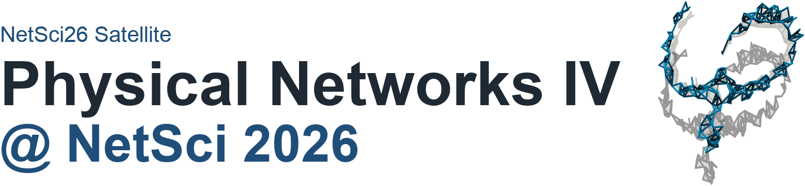
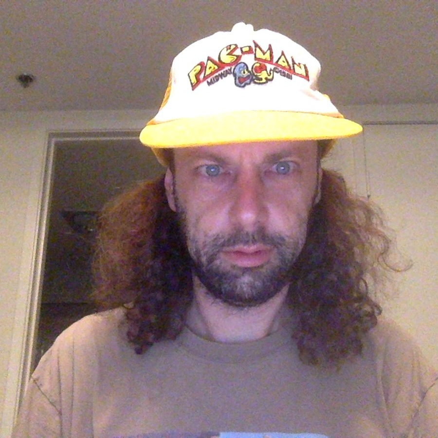
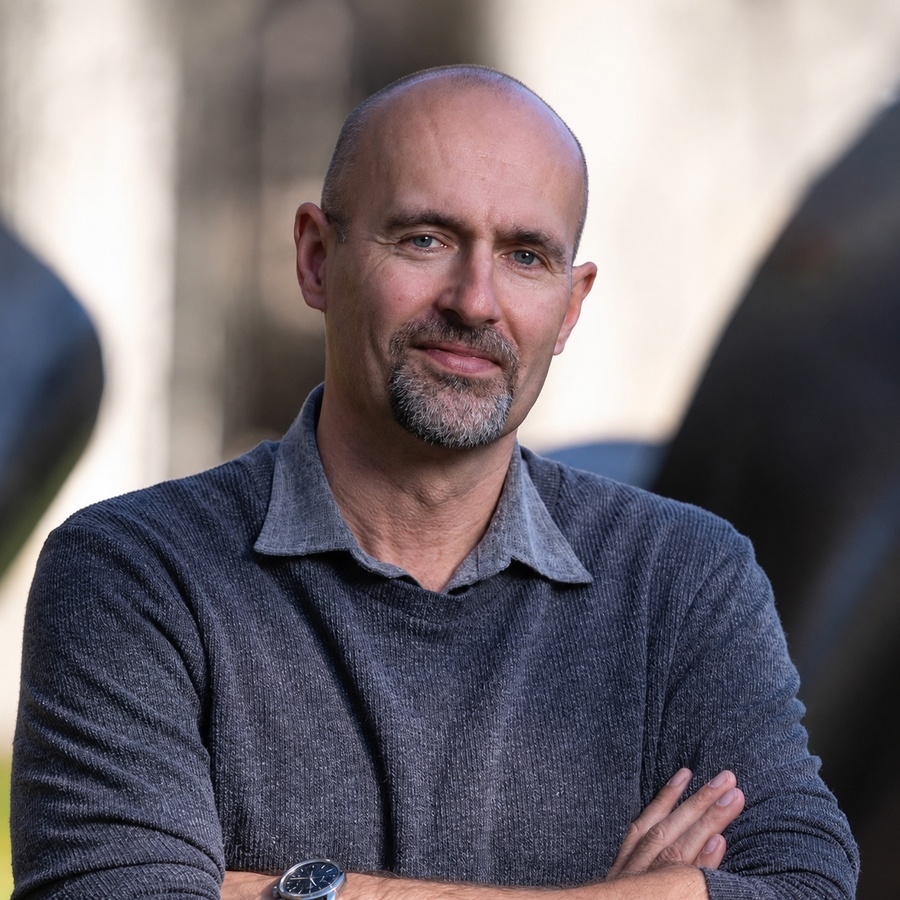
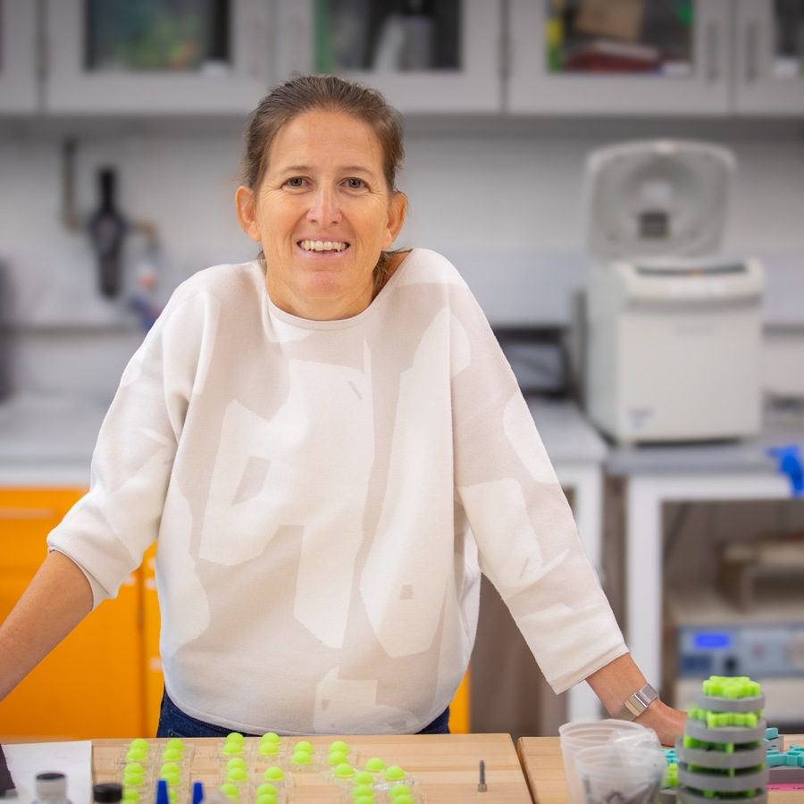

:::{ .landing-title }

```{=html}
<div class="landing-title-image-wrap edition-title-image-wrap">
  
</div>
```

<div class="subtitle">Physical networks aim to understand complex systems subjected to physical constraints, such as volume exclusion or repulsive forces, that shape their topological and geometric organization. Systems as diverse as neurons, cellular cytoskeletons, vascular structures, porous and colloidal networks, and disordered metamaterials are composed of nodes and links that are physical objects and cannot overlap with each other.</div>

<a class="btn-physnet" href="#program">View program</a>
<a class="btn-physnet secondary" href="https://sites.google.com/view/physnet26">Original Google Site</a>
:::

<!-- 
::: {.meta-strip}

::: {.meta-item}
<span class="meta-label">Date</span>
<span class="meta-value">June 2, 2026</span>
:::

::: {.meta-item}
<span class="meta-label">Time</span>
<span class="meta-value">14:30 to 18:00</span>
:::

::: {.meta-item}
<span class="meta-label">Venue</span>
<span class="meta-value">Hyatt Regency Boston/Cambridge, Cambridge, Massachusetts, USA</span>
:::

::: {.meta-item}
<span class="meta-label">Room</span>
<span class="meta-value">Harvard Square A</span>
:::

::: 
-->

::: {.event-summary}
::: {.summary-item}
**Date**  
June 2, 2026
:::

::: {.summary-item}
**Time**  
14:30 to 18:30
:::

::: {.summary-item}
**Venue**  
Hyatt Regency Boston/Cambridge, Cambridge, Massachusetts, USA
:::

::: {.summary-item}
**Room**  
Harvard Square A
:::
:::


## Speakers {#speakers}

::: {.speaker-grid}

::: {.speaker-card .with-photo}


### Mason A. Porter
Department of Mathematics  
University of California, Los Angeles
:::

::: {.speaker-card .with-photo}


### Jörn Dunkel
Department of Mathematics  
Massachusetts Institute of Technology
:::

::: {.speaker-card .with-photo}


### Katia Bertoldi
Harvard John A. Paulson School of Engineering and Applied Sciences  
Harvard University
:::

::: {.speaker-card .with-photo}


### Xiangyi Meng
Department of Physics, Applied Physics, and Astronomy  
Rensselaer Polytechnic Institute
:::

::: {.speaker-card .with-photo}


### Ivan Bonamassa
International Research Center for Complexity Science  
Hangzhou International Innovation Institute, Beihang University
:::

:::

## Program {#program}

::: {.program-list}

::: {.program-item}
<div class="program-time">14:30 to 14:35</div>
<div class="program-title">Opening Remarks</div>
<div class="program-speaker">Physical Networks Organizing Committee</div>
:::

::: {.program-item}
<div class="program-time">14:35 to 15:05</div>
<div class="program-title">Network Analysis of “Disordered Metamaterials”</div>
<div class="program-speaker">Mason A. Porter</div>

<details>
<summary>Abstract</summary>

Natural materials are often disordered, and their bulk properties are difficult to predict from their structure. In this talk, I will discuss work on the design and analysis of 3D-printed “disordered metamaterials”, which have tunable amounts of disorder. I will discuss our collaboration's pipeline from point clouds of different types to networks using a variety of constructions, and then to 3D-printed metamaterials. I will discuss the impact of point-cloud structure, especially on the amount and magnitude of hyperuniformity, on the local geometric and transport properties of the networks that we create with them. I will also bring physical samples of disordered metamaterials with me to show.

</details>
:::

::: {.program-item}
<div class="program-time">15:05 to 15:35</div>
<div class="program-title">Topological packing statistics of living and non-living matter</div>
<div class="program-speaker">Jörn Dunkel</div>

<details>
<summary>Abstract</summary>

Complex disordered matter is central to a wide range of disciplines, from bacterial colonies and embryonic tissues in biology to foams and granular media in materials science and stellar configurations in astrophysics. Because of the vast differences in composition and scale, comparing structural features across such disparate systems remains challenging. Here, using the statistical properties of Delaunay tessellations, we present a mathematical framework for quantifying topological distances between two- and three-dimensional point clouds. The resulting system-agnostic metric reveals subtle structural differences among bacterial biofilms and between zebrafish brain regions, and it recovers the temporal ordering of embryonic development. We apply this metric to construct a universal topological atlas spanning bacterial biofilms, snowflake yeast, plant shoots, zebrafish brain tissue, organoids, embryonic tissues, foams, colloidal packings, glassy materials, and stellar configurations.

</details>
:::

::: {.program-item}
<div class="program-time">15:35 to 16:00</div>
<div class="program-title">The shape of physical networks</div>
<div class="program-speaker">Xiangyi Meng</div>

<details>
<summary>Abstract</summary>

The brain's connectome and the vascular system are examples of physical networks: tangible, web-like objects that exist in real space. This physical reality means these networks combine a graph structure, describing their topological connectivity, with a physical structure, capturing the shape of all nodes and links. How do we best describe this physical structure? We can naturally model it as a geometric object, specifically, a manifold constructed in 3D space. To do this, we turn to an unexpected mathematical tool: the framework of covariant closed string field theory, developed in the 1980s. This framework provides an exact correspondence between network-like graphs and smooth surfaces. Using this string-theoretic interpretation, we show that geometric objects acquire network-like shapes precisely because they tend to minimize their surface area. By developing both a Riemann surface formulation and a numerical algorithm to simulate this minimization process, we find that it predicts structural features that challenge traditional models of network formation. Specifically, this minimization predicts the emergence of trifurcations and branching angles that, while defying conventional models such as Steiner graphs, are in excellent agreement with the local tree-like organization of physical networks across diverse domains, from human neurons to corals. We conclude by discussing potential applications of this fundamental discovery, from interpreting structural changes in neurological disorders to designing novel metamaterials.

</details>
:::

::: {.program-item .break}
<div class="program-time">16:00 to 16:30</div>
<div class="program-title">Coffee Break</div>
:::

::: {.program-item}
<div class="program-time">16:30 to 17:00</div>
<div class="program-title">TBA</div>
<div class="program-speaker">Katia Bertoldi</div>

<details>
<summary>Abstract</summary>

TBA

</details>
:::

::: {.program-item}
<div class="program-time">17:00 to 17:25</div>
<div class="program-title">TBA</div>
<div class="program-speaker">Ivan Bonamassa</div>

<details>
<summary>Abstract</summary>

TBA

</details>
:::

::: {.program-item}
<div class="program-time">17:25 to 17:45</div>
<div class="program-title">The structure and multifunctionality of physical networks in bone</div>
<div class="program-speaker">Alexandra Tits, Jack Fenwick, Ranjith Mudimadugula, Pascal Buenzli, Richard Weinkamer</div>

<details>
<summary>Abstract</summary>

Physical networks of micro- and nanoscopic channels are an ubiquitous feature of biological tissues. Despite their high density, these channels occupy a low volume fraction due to their submicron diameters. The network formed by those channels is crucial not only for transport and signaling, but also for mechanosensation. In bone, this network, known as the lacunocanalicular network (LCN), consists of lacunae, which serve as hubs, and canaliculi, narrow channels connecting them. This porosity network is fluid-filled and accommodates the cell network of osteocytes, including cell bodies and their dendrites. Characteristics of the osteocyte network are similar to the neural network of our brains: it contains 42 billion osteocytes forming 23 trillion connections [1], and one cubic centimeter of human bone comprises 74 kilometers of canaliculi.

We have developed an experimental and computational workflow that transforms high-resolution 3D confocal microscopy images of the LCN into spatial network graphs comprising tens of thousands of nodes and edges. Using our custom-built software TINA, Tool for Imaging and Network Analysis, we quantify network architecture in terms of density and spatial heterogeneity. Hydraulic circuit theory principles are applied to calculate the fluid flow through the network structure.

Bone mechanobiology has to deal with the paradox that bone is so stiff that resulting deformations are too small to be sensed by cells. As an amplification mechanism, the Fluid Flow Hypothesis was proposed, which states that load-induced fluid flow through the LCN generates forces detectable by cells. Using data on mice, we could demonstrate that predictions about new bone formation in response to mechanical loading had high accuracy when considering the fluid flow through the bone network [2]. Currently, we are investigating how the age-related structural changes in the network, such as the progressive closure of some channels and lacunae, affect the mechanosensitivity of bone.

Since during our lifetime new bone is constantly formed, the LCN within bone also has to grow. We observed that regions with a higher rate of bone formation exhibit denser networks. To explore the process of network growth computationally, we developed a mathematical model in which the creation of a new hub in the network during bone formation, that is, cell differentiation into an osteocyte, is coupled to the already existing network. By simulating different coupling mechanisms, we compare the networks obtained to experimental data to identify plausible rules governing network growth.

Since the osteocyte network is acting as the "brain" of our bones, any progress in how to interpret its structural and functional characteristics has wide applications in our understanding of bone health.

[1] Buenzli, P. R. and Sims, N. A. 2015. Quantifying the osteocyte network in the human skeleton. *Bone* 75, 144.  
[2] Van Tol, A. F., Schemenz, V., Willie, B. M. and Weinkamer, R. 2020. The mechanoresponse of bone is closely related to the osteocyte lacunocanalicular network architecture. *PNAS* 117, 32251.

</details>
:::

::: {.program-item}
<div class="program-time">17:45 to 18:00</div>
<div class="program-title">Random network models of ring clusters in hydrocarbon pyrolysis</div>
<div class="program-speaker">Perrin Ruth, Maria Cameron</div>

<details>
<summary>Abstract</summary>

We investigate the structure of overlapping rings in hydrocarbon pyrolysis, a complex system of carbon and hydrogen at extreme temperatures and pressures. Hydrocarbon pyrolysis is a useful test problem because it is relatively simple when studying the carbon skeleton, while still exhibiting complex structures. We predict the formation of a macroscale giant ring cluster using conventional random network models.

First, we decompose the ring cluster into a dual graph, i.e., a graph whose nodes represent cycles and whose edges represent pairs of cycles that share edges. We sample cycles from a uniform random minimum cycle basis developed in recent work [1]. The benefit of sampling cycles from a random minimum cycle basis is that it is statistically well-defined and grows linearly with graph size. Larger unique sets of cycles, e.g., the relevant cycles defined as the union of the minimum cycle bases [2], may grow exponentially with the number of nodes.

We develop random network models of the dual graph. Connection probabilities are represented as a matrix whose entry \((l_1,l_2)\) denotes the probability that two cycles of lengths \(l_1\) and \(l_2\) are connected by an edge. This matrix exhibits a low-rank structure. We investigate the ring cluster using a random dot product graph [3] type model and a random geometric graph [4] type model. We observe that the model without geometry overestimates the size of the giant ring cluster, and that the model with geometry underestimates the size of the giant ring cluster.

[1] P. Ruth and M. Cameron. In review. arXiv:2511.09732  
[2] P. Vismara. *Electronic Journal of Combinatorics* (1997).  
[3] A. Athreya et al. *Journal of Machine Learning Research* (2018).  
[4] M. Penrose. *Oxford University Press* (2003).

</details>
:::

:::

## Keywords

::: {.keyword-list}
<span>Network and Soft Materials</span>
<span>Statistical Topology</span>
<span>Random Packings</span>
<span>Rheology and Jamming</span>
<span>Network Geometry</span>
<span>Polymer Physics</span>
<span>Critical Phenomena</span>
:::

## Organizers

::: {.organizer-grid}

::: {.speaker-card}
### Márton Pósfai
Department of Network and Data Science, CEU
:::

::: {.speaker-card}
### Jasper van der Kolk
Department of Network and Data Science, CEU
:::

::: {.speaker-card}
### Ting-Ting Gao
Network Science Institute, Northeastern University
:::

::: {.speaker-card}
### Jun Yamamoto
Department of Network and Data Science, CEU
:::

:::

## Call for contributions

The call for contributions is closed. This section is retained for archival reference.

The satellite welcomed contributions spanning mathematics, physics, material science, computer science, biophysics, and related areas. Topics included 3D and 2D spatial networks, morphology and function, network materials, contact networks, brain networks, packings, and related systems.

## Archival note

::: {.archive-note}
Original public page: <https://sites.google.com/view/physnet26/>  
Detailed program page: <https://sites.google.com/view/physnet26/home/detailed-program>  
This is a curated static reconstruction intended for long-term preservation on GitHub Pages.
:::