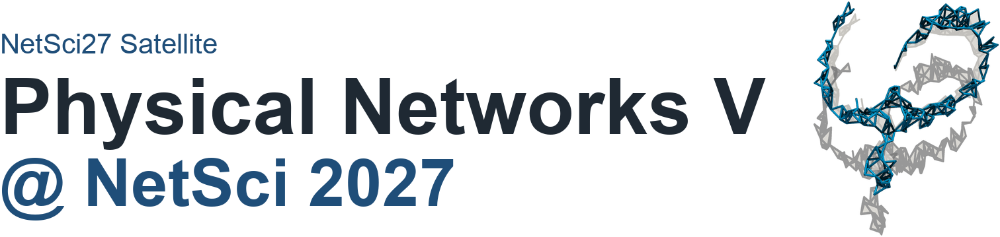

:::{ .landing-title }

```{=html}
<div class="landing-title-image-wrap edition-title-image-wrap">
  
</div>
```

<div class="subtitle">Physical networks aim to understand complex systems subjected to physical constraints, such as volume exclusion or repulsive forces, that shape their topological and geometric organization. Systems as diverse as neurons, cellular cytoskeletons, vascular structures, porous and colloidal networks, and disordered metamaterials are composed of nodes and links that are physical objects and cannot overlap with each other.</div>

<a class="btn-physnet" href="#program">View program</a>
<a class="btn-physnet secondary" href="TBA">Original Google Site</a>
:::

::: {.event-summary}
::: {.summary-item}
**Date**  
TBA
:::

::: {.summary-item}
**Time**  
TBA
:::

::: {.summary-item}
**Venue**  
TBA, TBA
:::

::: {.summary-item}
**Room**  
TBA
:::
:::


## Speakers

::: {.speaker-grid}


::: {.speaker-card .with-photo}


### TBA
TBA
:::


:::

## Program

::: {.program-list}


::: {.program-item}
<div class="program-time">TBA</div>
<div class="program-title">Opening Remarks</div>
<div class="program-speaker">Physical Networks Organizing Committee</div>


:::


:::

## Keywords

::: {.keyword-list}
<span>Network and Soft Materials</span>
<span>Statistical Topology</span>
<span>Random Packings</span>
<span>Rheology and Jamming</span>
<span>Network Geometry</span>
<span>Polymer Physics</span>
<span>Critical Phenomena</span>
:::

## Organizers

::: {.organizer-grid}


::: {.speaker-card}
### Márton Pósfai
Department of Network and Data Science, CEU
:::


::: {.speaker-card}
### Jun Yamamoto
Department of Network and Data Science, CEU
:::


:::

## Call for contributions

Details of the call for contributions will be announced later.


## Archival note

::: {.archive-note}
Original public page: <TBA>  
  
Detailed program page: <TBA>  

This is a curated static reconstruction intended for long-term preservation on GitHub Pages.
:::
