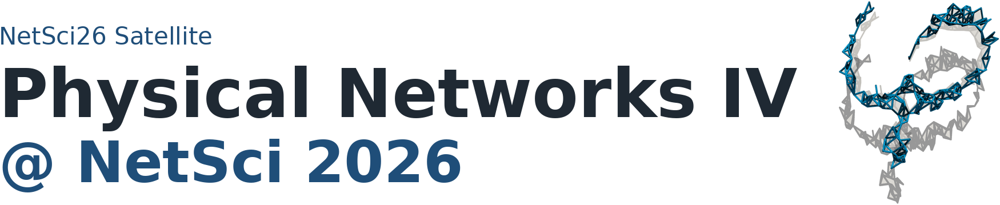
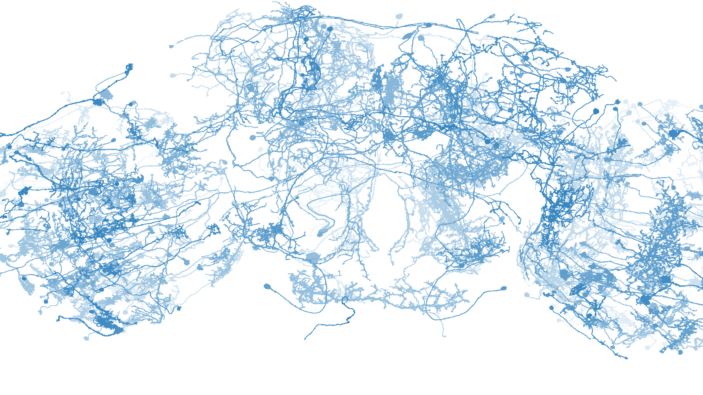
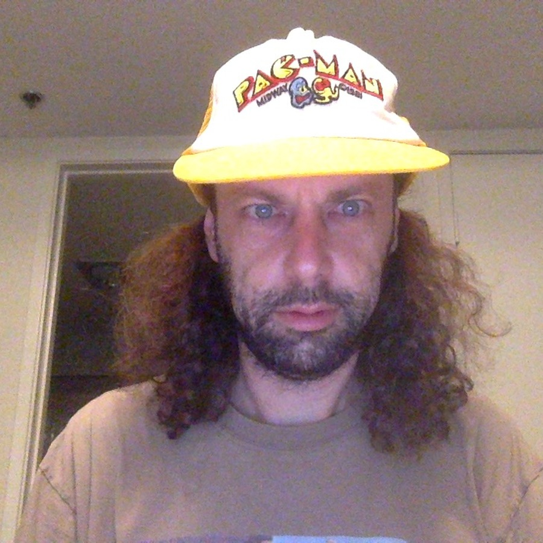
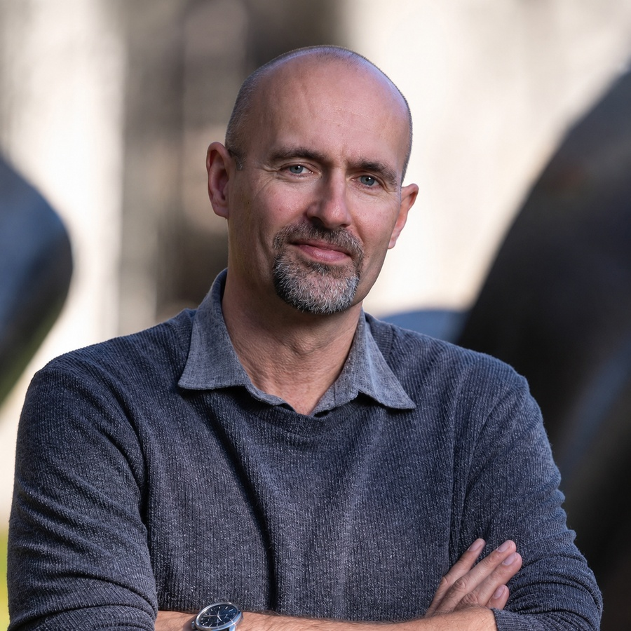
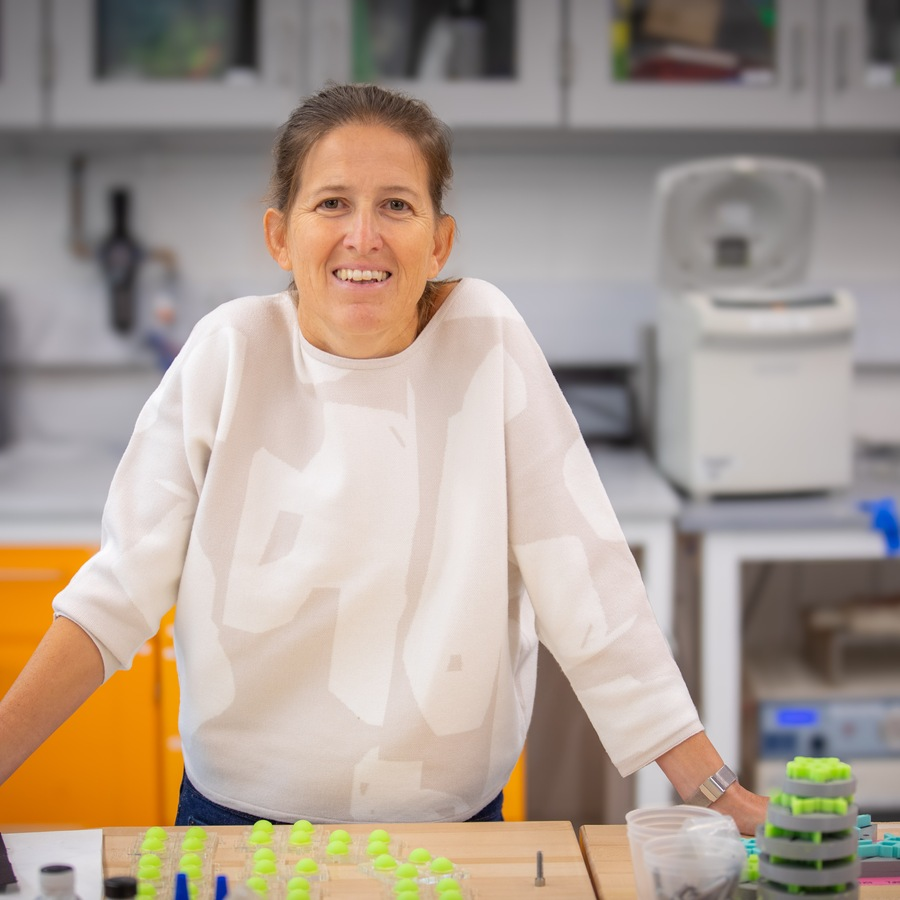
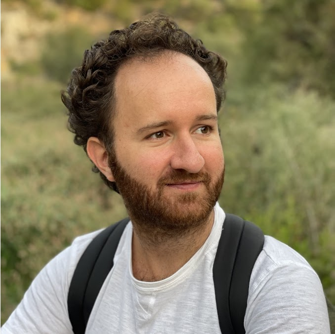

```{=html}
<div class="landing-title-image-wrap">
  
</div>
```

::: {.callout-warning appearance="simple"}
This is an archive of the original website for the Physical Networks IV satellite at NetSci26 hosted on Google Sites.
The content here may not be up to date, and some links may be broken. 
Please refer to the [current website](https://sites.google.com/view/physnet26) for the latest information about the satellite.
:::

Welcome to **Physical Networks IV**, a NetSci26 satellite on complex networks whose nodes and links are physical objects embedded in space.
The satellite is a half-day program at the Hyatt Regency, Boston, Massachusetts, USA, on **June 2, 2026, 14:30 to 18:00**.

::: {.quick-links}
[Schedule at a glance](#program){.quick-link}
[Meet our speakers](#speakers){.quick-link}
[Registration](#attend){.quick-link}
[Call for contributions](#call){.quick-link}
[Past editions](archive.qmd){.quick-link}
:::

::: {.event-summary}
::: {.summary-item}
**Date**  
June 2, 2026
:::

::: {.summary-item}
**Time**  
14:30 to 18:00
:::

::: {.summary-item}
**Venue**  
Hyatt Regency, Boston, Massachusetts, USA
:::

::: {.summary-item}
**Room**  
Harvard Square A
:::
:::

## Physical Networks: an emerging topic in Network Science

<!-- 
```{=html}
<div class="landing-image-wrap">
  
</div>
``` 
-->

Physical networks aim to understand complex systems subjected to physical constraints, such as volume exclusion or repulsive forces, that shape their topological and geometric organization.
Systems as diverse as neurons, cell cytoskeletons, vascular structures, porous and colloidal networks, and disordered metamaterials are complex systems consisting of nodes and links that are physical objects that cannot overlap with each other.

The interdisciplinary exploration of such a large variety of systems under the unifying framework of network science has just begun.

<!-- 
```{=html}
<p><a class="btn-physnet" href="https://sites.google.com/view/physnet26/home/detailed-program">Detailed program</a></p>
``` 
-->

## Program {#program}


```{=html}
<div class="program-table embedded-program compact-program">
<table aria-label="Program schedule">
<thead>
<tr>
<th>Time</th>
<th>Presenter / Authors</th>
<!-- <th>Affiliation</th> -->
<th>Title</th>
</tr>
</thead>
<tbody>
<tr>
<td class="time" data-label="Time">14:30-14:35</td>
<td data-label="Presenter / Authors"><span class="schedule-person"></span></td>
<!-- <td data-label="Affiliation"><span class="schedule-affiliation">Physical Networks Organizing Committee</span></td> -->
<td data-label="Title">Opening Remarks</td>
</tr>
<tr>
<td class="time" data-label="Time">14:35-15:05</td>
<td data-label="Presenter / Authors"><span class="schedule-person">Mason A. Porter</span></td>
<!-- <td data-label="Affiliation"><span class="schedule-affiliation">University of California, Los Angeles</span></td> -->
<td data-label="Title">Network Analysis of “Disordered Metamaterials”</td>
</tr>
<tr>
<td class="time" data-label="Time">15:05-15:35</td>
<td data-label="Presenter / Authors"><span class="schedule-person">Jörn Dunkel</span></td>
<!-- <td data-label="Affiliation"><span class="schedule-affiliation">Massachusetts Institute of Technology</span></td> -->
<td data-label="Title">Topological packing statistics of living and non-living matter</td>
</tr>
<tr>
<td class="time" data-label="Time">15:35-16:00</td>
<td data-label="Presenter / Authors"><span class="schedule-person">Xiangyi Meng</span></td>
<!-- <td data-label="Affiliation"><span class="schedule-affiliation">Rensselaer Polytechnic Institute</span></td> -->
<td data-label="Title">The shape of physical networks</td>
</tr>
<tr class="break-row">
<td class="time" data-label="Time">16:00-16:30</td>
<td data-label="Presenter / Authors"></td>
<!-- <td data-label="Affiliation"></td> -->
<td data-label="Title">Coffee Break</td>
</tr>
<tr>
<td class="time" data-label="Time">16:30-17:00</td>
<td data-label="Presenter / Authors"><span class="schedule-person">Katia Bertoldi</span></td>
<!-- <td data-label="Affiliation"><span class="schedule-affiliation">Harvard University</span></td> -->
<td data-label="Title">Networks in Textiles: Fracture and Mechanical Functionality</td>
</tr>
<tr>
<td class="time" data-label="Time">17:00-17:25</td>
<td data-label="Presenter / Authors"><span class="schedule-person">Ivan Bonamassa</span></td>
<!-- <td data-label="Affiliation"><span class="schedule-affiliation">Beihang University</span></td> -->
<td data-label="Title">TBA</td>
</tr>
<tr>
<td class="time" data-label="Time">17:25-17:45</td>
<td data-label="Presenter / Authors">
<span class="schedule-person">Richard Weinkamer</span>
<!-- Add coauthors here if needed, for example:
            <br />Coauthor Name, Coauthor Name
            -->
</td>
<!-- <td data-label="Affiliation"><span class="schedule-affiliation">Max Planck Institute of Colloids and Interfaces</span></td> -->
<td data-label="Title">The structure and multifunctionality of physical networks in bone</td>
</tr>
<tr>
<td class="time" data-label="Time">17:45-18:00</td>
<td data-label="Presenter / Authors">
<span class="schedule-person">Perrin Ruth</span>
<!-- Add coauthors here if needed, for example:
            <br />Coauthor Name, Coauthor Name
            -->
</td>
<!-- <td data-label="Affiliation"><span class="schedule-affiliation">University of Maryland</span></td> -->
<td data-label="Title">Random network models of ring clusters in hydrocarbon pyrolysis</td>
</tr>
</tbody>
</table>
</div>
```

```{=html}
<p><a class="btn-physnet" href="program.qmd">Open detailed program and abstracts</a></p>
```


## Meet our speakers {#speakers}

::: {.people-grid}
::: {.person-card}


### [Mason A. Porter](https://www.math.ucla.edu/~mason/)
Department of Mathematics  
University of California, Los Angeles
:::

::: {.person-card}


### [Jörn Dunkel](https://math.mit.edu/~dunkel/)
Department of Mathematics  
Massachusetts Institute of Technology
:::

::: {.person-card}


### [Katia Bertoldi](https://bertoldi.seas.harvard.edu/)
Harvard John A. Paulson School of Engineering and Applied Sciences  
Harvard University
:::

::: {.person-card}


### [Xiangyi Meng](https://www.xmeng.io/)
Department of Physics, Applied Physics, and Astronomy  
Rensselaer Polytechnic Institute
:::

::: {.person-card}


### Ivan Bonamassa
International Research Center for Complexity Science, Hangzhou International Innovation Institute (H3I)  
Beihang University
:::
:::

## Registration {#attend}

There are registration options for the [satellite-only event](https://www.netsci2026.com/registration) or for the full [NetSci26 conference](https://www.netsci2026.com/).
Traveling funds for the satellite's applicants are available upon reasonable request. Please contact the organizers for more information.

## Keywords

::: {.keyword-list}
<span>Network &amp; Soft Materials</span>
<span>Statistical Topology</span>
<span>Random Packings</span>
<span>Rheology &amp; Jamming</span>
<span>Network Geometry</span>
<span>Polymer Physics</span>
<span>Critical Phenomena</span>
:::

## Call for contributions {#call}

We welcome contributions spanning multiple disciplines, including mathematics, physics, material science, computer science, and biophysics. Following the success of the first, second, and third satellites, the aim is to create an interdisciplinary venue focusing on short talks and discussions that address key challenges, innovative ideas, applications, and recent advances on physical networks or related topics.

::: {.callout-note appearance="simple"}
**Submit a contributed talk.** Are you working with networks where the shape of nodes and links matter?

Submit an abstract to present at Physical Networks IV.

Topics include 3D and 2D spatial networks, morphology and function, network materials, contact networks, brain networks, packings, and related systems.

**Deadline:** April 30, 2026, Anywhere on Earth.   
**Submission:** send a one-page abstract to [physnet@ceu.edu](mailto:physnet@ceu.edu).   
**Status:** The application period is now closed.
:::

```{=html}
<!-- <p><a class="btn-physnet" href="mailto:physnet@ceu.edu"><strike>Apply</strike></a></p> -->
<p><span class="btn-physnet disabled" aria-disabled="true">Application period closed</span></p>
```

## Organizing committee

::: {.organizer-grid}

::: {.speaker-card}
### Márton Pósfai
Department of Network and Data Science, CEU
:::

::: {.speaker-card}
### Jasper Van der Kolk
Department of Network and Data Science, CEU
:::

::: {.speaker-card}
### Ting-Ting Gao
Network Science Institute, Northeastern University
:::

::: {.speaker-card}
### Jun Yamamoto
Department of Network and Data Science, CEU
:::

:::

## Archive

Previous satellite editions are available in the [archive](archive.qmd). The archive is a curated static reconstruction of public Google Sites pages, with image placeholders designed to be replaced by manually downloaded local copies.
