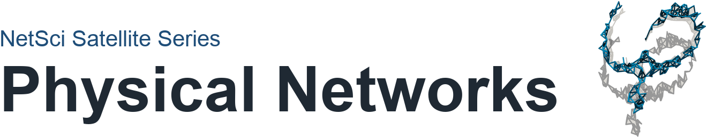

<!--
Generated file. Do not edit directly.
Edit data/series.yml, data/editions/*.yml, or templates/home_archive.qmd.j2 instead.
-->
---
title: ""
toc: false
listing: false
---

```{=html}
<div class="landing-title-image-wrap">
  
</div>
```

The **Physical Networks** satellite series brings together researchers working on networks whose nodes and links are physical objects embedded in space. The series focuses on how spatial embedding, geometry, volume exclusion, packing, material constraints, and physical interactions shape network structure and function.

The latest archived edition is **Physical Networks IV @ NetSci 2026**.

::: {.quick-links}
[View archive](archive.qmd){.quick-link}
[PhysNet 2026](editions/2026/index.qmd){.quick-link}
[PhysNet 2025](editions/2025/index.qmd){.quick-link}
[PhysNet 2024](editions/2024/index.qmd){.quick-link}
[PhysNet 2023](editions/2023/index.qmd){.quick-link}

:::

## Archive

::: {.edition-grid}


::: {.edition-card}
### [Physical Networks IV](editions/2026/index.qmd)

NetSci 2026  
Boston / Cambridge, Massachusetts, USA  
June 2, 2026
:::


::: {.edition-card}
### [Physical Networks III](editions/2025/index.qmd)

NetSci 2025  
Maastricht, the Netherlands  
June 2, 2025
:::


::: {.edition-card}
### [Physical Networks II](editions/2024/index.qmd)

NetSci 2024  
Québec City, Canada  
Monday, June 17, 2024
:::


::: {.edition-card}
### [Physical Networks I](editions/2023/index.qmd)

NetSci 2023  
Vienna, Austria  
Tuesday, July 11, 2023
:::


:::

## About the series

Physical networks are networked systems in which links and nodes are material or spatially embedded objects. Examples include neural connectomes, vascular structures, porous media, cellular and cytoskeletal networks, fiber systems, disordered metamaterials, and random packings.

The satellite series provides a common venue for network science, statistical physics, soft matter, biophysics, geometry, topology, and materials science perspectives on these systems.
